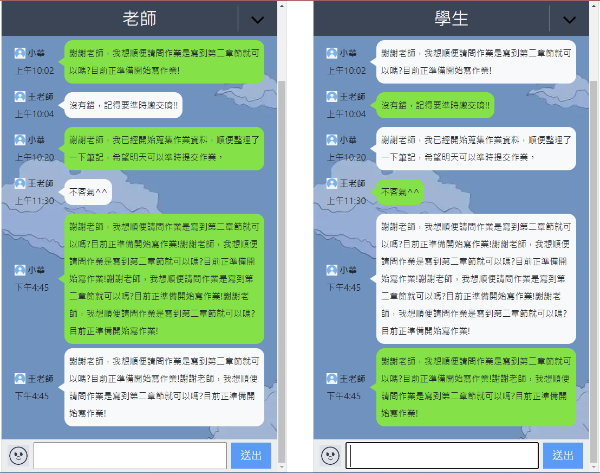
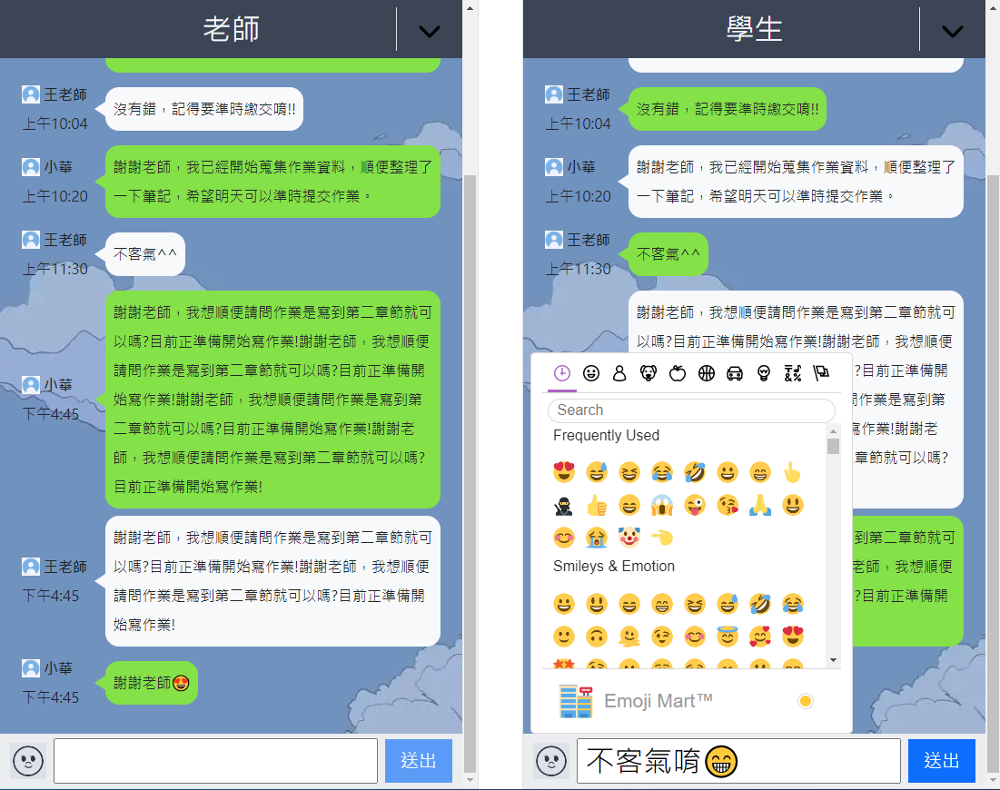

<h2>專案摺疊選單練習</h2>

- 使用 Bootstrap 元件

<h2>聊天室</h2>

- 模擬 Line 聊天室介面
- 自己的對話氣泡為綠色、對方則為白色 (Line 配色)
- 可使用 Emoji 功能
- 按下送出可發送訊息
- 有新對話時，對話滾動條自動置底

<h3>畫面截圖</h3>

<h3>操作示範</h3>

<video src="./src/assets/chatroom/readme示範圖/對話示範.mp4"></video>